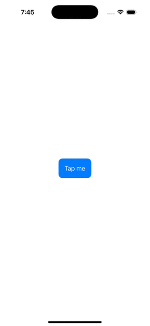

# 01 - Custom Reusable `ButtonStyle` Component

## Description

The first component of this series shows how to create a custom button style to reuse for a certain category/role of buttons in your view.

I know, it's quite simple, but we should start this series from somewhere, and I think it's better to work our way up to complexity by beginning with something simple.

## How to Import the Component/Framework

1. Create an iOS application.

2. Go to your Project Section.

3. Select the "General" tab.

4. Scroll down to the "Frameworks/Libraries" Section.

5. Click on the "+" button to add a new framework.

6. Add the package you downloaded, by selecting the "Add Files" option.

7. Import the framework within your view by typing "import ThemedButtonStyle".

8. Thank you!

## Usage Example

8. You should now be able to test my component.

9. Thank you!
